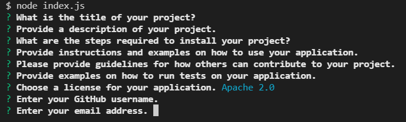
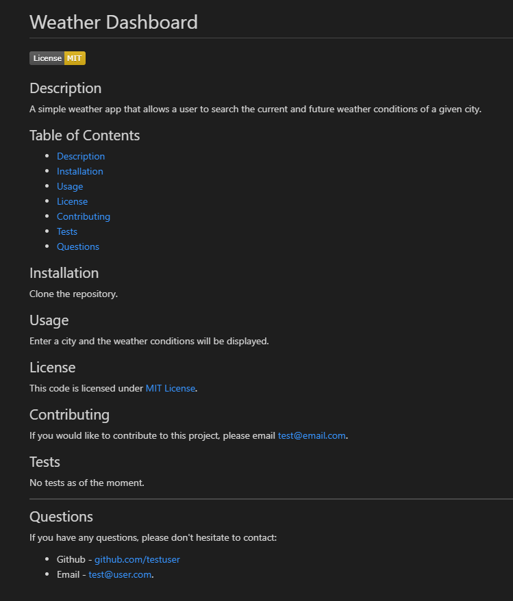

# README Generator

* A command-line application that dynamically generates a professional README.md file from a user's input.
* Built using Node.js and uses the [Inquirer package](https://www.npmjs.com/package/inquirer).

<br>

## Installation

* To use this application, you need to have Node.js installed.

* Install the Inquirer package in the project folder by entering the following command in your terminal: <br> ```npm i inquirer``` <br> 

<br>

## Usage

* Run the application in your teminal by entering the following command: <br>
```node index.js``` 
<br>

* You will be presented with a series of questions about your project.

<p align="center">
    
</p>

<br>

* The answers you provide will be used to populate the README file which will be generated after answering the last question.

<br>
<br>
<p align="center">
    <i>Sample Generated README file</i>
</p>
<br>

<p align="center">
    
</p>

<br>
<p align="center">
    <i>Walkthrough video</i>
</p>
<br>

https://user-images.githubusercontent.com/97539424/160262160-00424483-a030-4c09-aec7-60650857727c.mp4

<br>

## License

This code is licensed under the [MIT License](https://mit-license.org/).

<br>
<hr>

## Questions
If you have any questions, please don't hesitate to contact:
 * Email - neemavelasco@gmail.com


